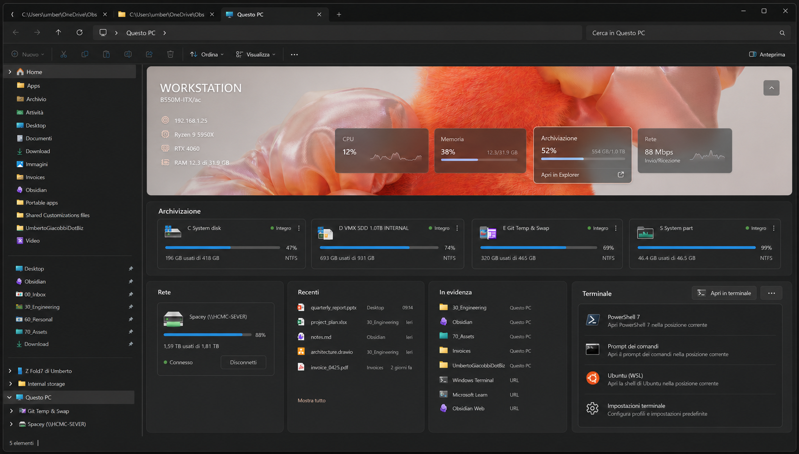

# Explorer Home V2

## Product and technical specification

| Field | Value |
| --- | --- |
| Status | Official design and implementation baseline |
| Version | 2.0 |
| Date | 2026-07-27 |
| Target | Windows 11, x64 and ARM64 |
| Repository | `views-explorer-welcome-poc` |
| Visual baseline | [`assets/explorer-home-v2-official.png`](assets/explorer-home-v2-official.png) |

This document defines the intended Explorer-hosted experience, the supported
integration boundary, the out-of-process data and action model, and the
validation gates required before the proof of concept can be considered
production-ready.



## 1. Executive decision

Explorer Home V2 is a dedicated Shell Namespace Extension surfaced under
**This PC**. It provides a Windows 11-quality dashboard inside the File Explorer
content area while preserving the normal Explorer chrome, tabs, address bar,
navigation pane, search box, command bar, theme, DPI behavior, and keyboard
model.

The product does **not** replace or patch the built-in Windows Home page.
Windows does not expose a supported public extension point for replacing that
page. During the POC the namespace entry should use an unambiguous display name
such as **Views Home**; the shorter label **Home** is a final naming decision
only if it cannot be confused with the built-in item.

The in-process Explorer component remains a thin native boundary. Collection
of system information, Shell enumeration, tool discovery, preferences, and
process launch all belong to the current-user broker or a separate app.

## 2. Product principles

1. **Storage first.** Local volumes, removable storage, and network locations
   are the primary content, not secondary widgets.
2. **One Windows source for pins.** Do not create a parallel pinned-items
   database. Use the items that Windows already exposes in Explorer whenever a
   supported and testable Shell path exists.
3. **Explorer remains Explorer.** Navigation, selection, context, default apps,
   properties, and file operations should use Shell semantics.
4. **The terminal is first-class but external.** Windows Terminal may be
   launched and controlled through its supported command line, but it is not
   embedded inside an Explorer tab.
5. **Installed tools are discovered.** `Open in...` shows relevant tools that
   are actually available on the machine instead of a permanently hardcoded
   list.
6. **No AI surface in V2.** There is no prompt box, AI assistant, or AI quick
   action in this design.
7. **No generic quick-action strip.** Create, copy, move, rename, and delete
   remain Explorer commands and do not occupy dashboard space.
8. **Personal without becoming noisy.** The desktop wallpaper gives the page
   personality; system colors, typography, spacing, and controls keep it native.
9. **Stationary interaction.** Hover and pointer states must never translate,
   lift, offset, or nudge an element. Use color, border, shadow, glow, underline,
   or opacity only.
10. **Useful when partially unavailable.** A failed network share, missing
    wallpaper, stopped broker, or absent developer tool must degrade locally
    without blanking the page or blocking Explorer.

## 3. Scope

### 3.1 Included

- Collapsible workstation hero using the current desktop wallpaper.
- Computer name, model, primary IP address, CPU, GPU, and memory summary.
- Live CPU, memory, storage, and network utilization cards.
- Local and removable storage with capacity, free/used space, file system, and
  best-effort health.
- Network locations with connection and capacity state when available.
- Recent documents sourced from Windows.
- A single Windows-backed highlighted/pinned collection.
- Contextual navigation and `Open in...` actions.
- Terminal profiles and Windows Terminal launch behavior.
- Customizable links to common Windows Settings pages.
- Light, dark, high-contrast, DPI, keyboard, touch, and screen-reader behavior.
- Current-user preferences and cache.

### 3.2 Excluded from V2

- Replacing the built-in Explorer Home page.
- Injecting custom controls into Explorer's tab strip, address bar, search box,
  command bar, or navigation pane outside the registered namespace item.
- Hosting a terminal control inside Explorer.
- AI prompts, indexing, semantic search, or remote AI services.
- A second favorites or pinned-items store.
- Reading or editing undocumented `AutomaticDestinations` or
  `CustomDestinations` database files.
- Arbitrary user-provided command templates executed by the in-process DLL.
- Elevation, administrator-only probes, or privileged system management.
- Production telemetry until privacy, schema, and opt-in behavior are reviewed.

## 4. Explorer integration model

### 4.1 Supported entry point

The POC registers a native COM Namespace Extension as a virtual junction point
under **This PC**. The extension implements the minimum Shell folder and view
contracts needed for Explorer to host the page:

- `IShellFolder` for the namespace root and item identity.
- `IShellView` for the hosted content surface and Explorer lifecycle.
- `IShellBrowser` services supplied by Explorer for in-window navigation.
- A Win32 child window hosting a `DesktopWindowXamlSource` XAML Island.

The extension is loaded into `explorer.exe`, so every callback must be bounded,
fast, deterministic, and safe during teardown. It must never wait on network
I/O, run a system scan, discover tools, parse terminal settings, or start a
process while Explorer is asking it to create or lay out the view.

### 4.2 Process boundary

```text
File Explorer
  |
  +-- ExplorerWelcome.NamespaceExtension.dll
  |     IShellFolder + IShellView + XAML Island
  |     cached immutable view model only
  |
  +---- current-user named pipe ---- ExplorerWelcome.Broker
                                      |
                                      +-- system snapshot collectors
                                      +-- Shell item enumeration
                                      +-- recent and pin adapters
                                      +-- installed-tool discovery
                                      +-- validated action launcher
                                      +-- preferences and short-lived cache
                                      |
                                      +-- ExplorerWelcome.HeavyApp
                                          settings, diagnostics, future UI
```

The native view shows its last valid snapshot immediately and requests a
refresh asynchronously. A broker timeout, disconnect, or unsupported protocol
version produces a local stale/offline state; it must not freeze Explorer.

### 4.3 Deployment stages

- **Current POC:** reversible per-user COM registration for controlled tests.
- **Pre-production:** MSIX or sparse-package identity with manifest-based COM
  registration.
- **Context-menu integration:** a separate native `IExplorerCommand` class,
  registered through `windows.fileExplorerContextMenus`, only after the view
  and action broker are stable.
- **Production:** signed architecture-matched packages, rollback, update,
  crash isolation review, accessibility validation, and enterprise servicing.

Legacy context-menu handlers and undocumented registry injection are not part
of the design.

## 5. Information architecture

The official desktop layout has three visual bands.

### 5.1 Workstation hero

The hero is the visual identity of the page and is collapsible.

Left column:

- Computer display name, for example `WORKSTATION`.
- Device model.
- Primary active IPv4 or IPv6 address.
- CPU model.
- GPU model.
- Used and total physical memory.

Resource cards:

- CPU utilization and short sparkline.
- Memory utilization and used/total values.
- System storage utilization and used/total values.
- Network send/receive activity and short sparkline.

Hero behavior:

- Use the current desktop wallpaper, cropped with `UniformToFill`.
- Add a theme-aware scrim so all text meets contrast requirements.
- Preserve the focal area as far as possible; never stretch the image.
- If wallpaper access fails, use a system-color gradient, not a broken image.
- If monitors have different wallpapers or a slideshow is active, prefer the
  wallpaper for the monitor containing the Explorer window.
- The collapse button remains in the top-right and has an accessible name.
- Collapsed state retains the machine name and a compact resource summary.
- The collapsed preference persists per user.

Contextual hero actions:

- Hover or keyboard focus may reveal an action footer without changing card
  geometry.
- Storage: **Open in Explorer** navigates to the system volume.
- Network: **Show network locations** navigates to the relevant Shell location.
- CPU, GPU, and memory do not show a misleading Explorer link. A future
  **Open Task Manager** action may be added after a separate product decision.
- Every hover-only action must also be available by keyboard focus and through
  the card overflow menu.

### 5.2 Storage

Storage spans the page width and remains the strongest content block.

Each card contains:

- Shell icon or volume icon from Windows.
- Drive letter and user-visible label.
- Health indicator when the source is reliable.
- Used-capacity progress bar.
- Used and total capacity.
- File system when available.
- Overflow menu.

Card states:

- Healthy/available.
- Low space: warning starts at a configurable threshold, initially 10% free.
- Critical space: critical state starts at 5% free.
- Offline or unavailable.
- Removable and empty.
- Locked or access denied.
- Unknown health. Never display **Healthy** when health was not actually
  obtained.

Primary click navigates according to the user's folder-navigation preference.
The overflow menu offers the actions defined in section 8.

### 5.3 Lower dashboard

The desktop layout uses four cards:

1. **Network**: connected network shares and network locations.
2. **Recent**: recent documents supplied by Windows.
3. **Highlighted**: the single Windows-backed pin/favorite collection.
4. **Terminal**: installed terminal profiles and settings.

At narrower widths the cards reflow to two columns and then one column. The
page scrolls vertically inside the Explorer content area. No horizontal scroll
is allowed at supported widths.

### 5.4 Quick Settings

A customizable **Quick Settings** strip appears below the primary dashboard,
and may be hidden by the user. It is below the fold in the official desktop
composition, which is why it is not visible in the baseline image.

Initial suggestions:

- Display
- Sound
- Network and Internet
- Bluetooth and devices
- Storage
- Windows Update
- Personalization
- Apps

Links use documented `ms-settings:` URIs. Users may reorder, hide, or restore
suggestions. V2 does not accept arbitrary executable commands in this section.

## 6. Windows-backed pins and recent items

### 6.1 Single-source rule

The **Highlighted** card must not become a second favorites product.

- Folders should reflect Windows Quick Access pins when a supported Shell
  enumeration path is proven.
- Favorite files should reflect Windows Explorer favorites when a supported
  Shell enumeration path is proven.
- The page must not edit private destination-list files or reverse-engineer
  their binary format.
- Pin/unpin actions are shown only when they can invoke the corresponding
  Windows Shell behavior reliably.
- If native pin enumeration cannot be implemented through a supported contract,
  the POC shows an explanatory unavailable state or omits the card. It must not
  silently substitute a private list.

URLs, applications, and tool shortcuts appeared in earlier visual exploration,
but they are not stored in a custom V2 pin database. They may appear only if a
future Windows-backed Shell source can represent and enumerate them without
breaking the single-source rule.

### 6.2 Recent items

- Resolve `FOLDERID_Recent` through the Known Folder APIs.
- Enumerate Shell links as Shell items and resolve targets without executing
  them.
- Respect Windows and Explorer privacy settings for recent items.
- Filter missing targets and deduplicate by canonical Shell identity.
- Keep at most the configured visible count, initially five.
- **Show all** navigates to the corresponding Windows recent-items surface when
  available; otherwise it opens a dedicated full list inside this namespace.
- Opening a document uses its registered default application.
- Do not manufacture or inflate recency by calling `SHAddToRecentDocs` for
  background reads.

## 7. Navigation behavior

### 7.1 Default-click preference

The user preference is named **Open folders from the dashboard**:

- **In this Explorer tab**: use `IShellBrowser::BrowseObject` with
  `SBSP_SAMEBROWSER`.
- **In a new Explorer tab**: product requirement, exposed only after a supported
  and reliable capability is proven on the target Windows build.

Windows currently documents same-browser and new-browser-window navigation,
but not a stable public flag that guarantees a new Explorer tab. The POC must
not call private command IDs or assume that an undocumented verb is permanent.
Until the capability gate passes, the settings UI must either disable
**new Explorer tab** with an explanation or offer the clearly labelled
**new Explorer window** behavior using supported Shell navigation.

Additional rules:

- The preference applies to folders, drives, and network locations.
- Files open in the registered application.
- URLs open through the registered protocol handler.
- `SBSP_DEFBROWSER` is available as a **Follow Windows setting** option if user
  testing shows it is less surprising than forcing a location.
- Middle-click and `Ctrl+Enter` may request a new tab only after the same public
  capability gate passes.
- Broken targets remain visible long enough to explain the failure and offer
  removal through the native Windows source when possible.

### 7.2 Explorer chrome

The custom view must cooperate with:

- Back and forward navigation.
- Address-bar identity and travel history.
- Tab close and window close.
- Search-box focus without pretending to implement Explorer search in V2.
- Command-bar state and selection changes.
- Theme changes while the view is open.
- DPI and monitor transitions.

The view must correctly translate keyboard accelerators while it has focus.

## 8. Context menus and `Open in...`

### 8.1 Core item menu

The in-page overflow menu is contextual and may contain:

- Open.
- Open in this Explorer tab.
- Open in new Explorer tab, only when supported.
- Open in new Explorer window.
- Open in terminal.
- Open in...
- Copy path or address.
- Properties.
- Pin to or unpin from Windows Quick Access/Favorites, only when supported.
- Disconnect for eligible network mappings.

Destructive actions are not promoted in the dashboard. File deletion, drive
formatting, share removal, and administrative storage actions remain in their
normal Windows surfaces.

### 8.2 Tool discovery

`Open in...` is a capability-discovery layer, not a fixed menu.

Initial adapters:

| Tool | Relevant targets | Example action |
| --- | --- | --- |
| Windows Terminal | Folder, drive, network path when supported | Start a profile in that location |
| PowerShell 7 | Folder, drive | Open shell at location |
| Command Prompt | Folder, drive | Open shell at location |
| WSL distribution | Folder or translated Windows path | Start distribution at location |
| Visual Studio Code | File, folder, workspace | Open target |
| Visual Studio | Solution, project, supported folder | Open target |
| Codex | Repository or folder | Start Codex in context |
| GitHub CLI | Git repository or supported GitHub URL | Open relevant CLI workflow |
| Other registered tools | Adapter-declared target types | Tool-specific open action |

Discovery runs out of process and may inspect:

- Package registrations.
- Application registration and App Paths.
- The current user's and machine's executable search path.
- Known vendor install locations only when the adapter documents them.
- Tool-provided version or capability output with a strict timeout.

The UI shows only installed, enabled, and contextually relevant adapters.
Discovery results are cached and refreshed after package/app changes or on
explicit request.

Each adapter defines:

- Stable tool ID and display name.
- Trusted executable or activation identity.
- Supported target kinds.
- Argument construction rules.
- Icon source.
- Version/capability probe.
- Whether network paths, URLs, or multiple selections are allowed.
- Whether a new process, existing window, or tool-managed reuse is requested.

The native Explorer DLL never constructs or runs arbitrary command strings. It
sends a bounded action request to the broker. The broker revalidates the target,
tool, action, and current-user context before activation. Arguments are passed
as structured values and escaped for the selected process API; they are never
concatenated into `cmd.exe /c` or a PowerShell expression.

### 8.3 Future Windows 11 context menu

After the in-page action broker is stable, the same adapter catalog may be
exposed from normal Explorer items through a packaged `IExplorerCommand`:

- Top-level **Open in terminal** for folders and folder backgrounds.
- Grouped **Open in...** flyout for discovered tools.
- Fast title, icon, and state callbacks.
- All discovery and slow validation outside the menu-construction path.
- Architecture-matched native DLL and package registration.

This is a separate phase from the current namespace-view POC.

## 9. Terminal card

The terminal card is a compact launcher, not a terminal emulator.

Default rows:

- PowerShell 7, when installed.
- Command Prompt.
- Installed WSL distributions, with Ubuntu shown as an example.
- Terminal settings.

Behavior:

- The primary **Open in terminal** action uses the page's current context. On
  the Home root, the default working directory is user-configurable and starts
  as the user's profile folder.
- A drive or folder menu uses that selected location as the starting directory.
- Windows Terminal is preferred when installed.
- `wt.exe -w 0 new-tab -d <path>` may target the most recently used Terminal
  window, subject to Windows Terminal's own `windowingBehavior`.
- `wt.exe -w -1 new-tab -d <path>` explicitly requests a new Terminal window.
- If Windows Terminal is absent, a compatible installed shell may be launched
  directly.
- Network paths are offered only to profiles that can use them safely.
- Terminal settings opens the installed Terminal settings experience.
- The card does not promise that a terminal will appear in an Explorer tab.

## 10. Data model and refresh

The versioned named-pipe contract should evolve from the current minimal
snapshot to explicit section models. A V2 response contains:

- `machine`: name, model, OS display version, primary network identity.
- `metrics`: CPU, GPU, memory, storage, network samples and timestamps.
- `storage`: Shell identity, path, label, type, capacity, file system, health.
- `networkLocations`: Shell identity, UNC path, display name, state, capacity.
- `recentItems`: Shell identity, target kind, display name, parent, timestamp.
- `highlightedItems`: source, Shell identity, target kind, pin capability.
- `terminalProfiles`: profile identity, display name, icon, availability.
- `tools`: discovered adapters and target capabilities.
- `quickSettings`: configured `ms-settings:` destinations.
- `preferences`: collapse state, layout, visible modules, navigation behavior.
- `freshness`: generation timestamp and per-section errors.

Every request and response includes:

- Protocol version.
- Message type.
- Correlation ID.
- Generated timestamp.
- Bounded collection counts.
- Explicit unsupported-version and unsupported-request errors.

Suggested refresh policy:

| Data | Refresh |
| --- | --- |
| CPU, GPU, memory, network rate | 1-2 seconds while visible |
| Storage capacity | 30 seconds and device-change notification |
| Network location state | 30 seconds and network-change notification |
| Machine identity | At broker start and system-change notification |
| Wallpaper | At view start and personalization-change notification |
| Recent items | At navigation to Home and at most every 10 seconds |
| Windows-backed pins | At navigation to Home and Shell-change notification |
| Tool discovery | At broker start, app-change signal, or manual refresh |
| Quick Settings and preferences | Immediately after local change |

Metrics collection pauses or slows substantially when the view is hidden. The
native view receives compact snapshots, not unbounded sample history.

## 11. Data sources

Preferred supported Windows sources include:

| Information | Preferred source |
| --- | --- |
| Desktop wallpaper | `IDesktopWallpaper::GetWallpaper` |
| Computer name | `GetComputerNameEx` |
| Network addresses | `GetAdaptersAddresses` |
| Memory | `GlobalMemoryStatusEx` |
| CPU and network rates | Windows performance counters or equivalent supported API |
| GPU identity/utilization | DXGI plus supported performance counters |
| Volumes | Shell items, volume APIs, `GetDiskFreeSpaceEx` |
| File-system and volume label | `GetVolumeInformation` |
| Device arrival/removal | Windows device/volume notifications |
| Network resources | Shell namespace or Windows networking APIs |
| Recent documents | `FOLDERID_Recent` and Shell item resolution |
| Windows pins/favorites | Supported Shell enumeration only; capability gate |
| Settings links | Documented `ms-settings:` URIs |

The broker should preserve Shell item identity where possible instead of
reducing every item to a file-system path. This is required for virtual folders,
network locations, properties, icons, and non-file targets.

## 12. Visual and interaction system

- Use system typography and Windows 11 control metrics.
- Use theme resources instead of fixed light/dark colors.
- Use rounded cards, subtle borders, layered material, and restrained shadow.
- The desktop wallpaper is the only large decorative image.
- Icons come from Shell items or reviewed product assets; do not scrape icons
  from installed executables for redistribution.
- Capacity and health must not rely on color alone.
- Progress bars have accessible names and values.
- Sparkline animation is optional and disabled under reduced-motion settings.
- Loading placeholders do not move surrounding content when data arrives.
- Hover does not change position or size.
- Touch targets are at least 40 by 40 effective pixels.
- Keyboard focus is always visible.
- Overflow menus are reachable by keyboard and screen reader.
- All hover-revealed commands are also available on focus and touch.
- Layout supports 100%, 125%, 150%, 200%, and 300% scaling.
- The initial product locale is Italian UI with English source and resource
  keys; all strings must remain localizable.

## 13. Loading, empty, and failure states

### 13.1 Initial load

- Paint the page shell and last valid cached snapshot immediately.
- Mark cached values with their timestamp if older than the normal refresh
  interval.
- Use stable placeholders for sections with no cache.
- Replace sections independently as fresh data arrives.

### 13.2 Broker unavailable

- Keep Explorer responsive.
- Show the cached dashboard with a discreet **Information may be out of date**
  status.
- Offer **Retry** and **Open diagnostics** outside the in-process callback.
- Do not repeatedly reconnect in a tight loop.

### 13.3 Empty sections

- No recent items: explain that Windows has no recent documents to show.
- No Windows pins: offer the normal Windows pin workflow, not a custom list.
- No network locations: show **No connected network locations**.
- No Windows Terminal: hide Terminal-specific profiles and explain the fallback.
- No optional tools: omit `Open in...` rather than showing disabled clutter.

### 13.4 Partial failures

Each section carries its own error and freshness state. One unavailable network
share must not mark all storage unavailable. Unknown health is different from
unhealthy. Missing GPU metrics must not hide CPU and memory.

## 14. Preferences

Preferences are current-user-only and must be small, versioned, and recoverable
to defaults:

- Hero expanded/collapsed.
- Visible modules and order, within supported layout slots.
- Quick Settings links and order.
- Default dashboard working directory for Terminal.
- Preferred Terminal profile.
- Folder navigation behavior.
- Capacity warning thresholds.
- Privacy toggles for IP address and device details.
- Metric refresh mode: live, reduced, or paused.

Preferences never contain credentials, command scripts, terminal history, or a
duplicate list of Windows pins.

## 15. Security and privacy

- Keep the named pipe restricted to the current interactive user.
- Bound message size, list counts, strings, and timeouts.
- Reject unknown protocol versions and action types.
- Never trust paths or tool IDs supplied by the UI without broker validation.
- Do not log document names, paths, UNC shares, IP addresses, or tool arguments
  by default.
- Do not send system information off device.
- Do not require elevation.
- Do not follow links during background enumeration.
- Do not execute recent items or Shell links while resolving metadata.
- Use Shell or process activation APIs directly; avoid intermediate command
  interpreters.
- Confirm or reject unsupported multi-selection and network-path actions.
- Treat icons, thumbnails, and wallpaper as private local content.
- The native DLL must fail closed when the broker response is malformed.

## 16. Performance budgets

Initial POC targets:

- Namespace view creation: first stable frame within 250 ms using cache or
  placeholders.
- No Explorer-facing callback blocked longer than 50 ms.
- Cached page usable without broker response.
- Broker handshake timeout: 500 ms.
- First fresh local snapshot: within 1.5 seconds on the reference workstation.
- Tool discovery: asynchronous, strict per-adapter timeout, never on first
  Explorer frame.
- Live metric update payload: bounded and coalesced to at most one UI update per
  second.
- Native view memory growth: stable across 50 open/close cycles.
- No orphaned broker request or timer after view destruction.

These are acceptance targets, not claims about the current implementation.

## 17. Accessibility requirements

- Full operation with keyboard only.
- Logical tab order matching visual order.
- Arrow-key navigation inside card lists where appropriate.
- Accessible name, role, state, and value for every card and progress control.
- Announce stale, offline, warning, and critical states without repeated live
  region noise.
- Narrator reads drive label, used space, total space, and health as one concise
  item.
- High Contrast uses system colors and visible boundaries.
- Text remains readable at 200% text scaling without clipping.
- Reduced motion disables decorative sparkline transitions.
- Hero wallpaper can be suppressed for contrast or user preference.

## 18. Validation plan

### 18.1 Automated

- Build managed and native projects for x64 and ARM64.
- Protocol compatibility and malformed-message tests.
- Message-size and list-count boundary tests.
- Tool-adapter argument and target validation tests.
- Preference migration and reset tests.
- Secret and private-path scan.
- Static analysis for forbidden heavy work in the Shell DLL.
- Tests that hover styles contain no geometric transforms or offsets.

### 18.2 Manual Explorer matrix

- Supported Windows 11 release and current supported update.
- Light, dark, High Contrast, and live theme switching.
- 100%, 125%, 150%, 200%, and 300% scaling.
- Single and mixed-DPI multi-monitor systems.
- Static wallpaper, per-monitor wallpaper, slideshow, and solid color.
- Explorer tabs, multiple windows, rapid open/close, and Explorer restart.
- Local NTFS/ReFS volumes, removable media, full disk, empty optical drive.
- Connected, disconnected, slow, authenticated, and unavailable network shares.
- Recent-items privacy enabled and disabled.
- Empty, populated, and changing Windows pins.
- Windows Terminal installed, absent, updating, and configured for window reuse.
- PowerShell, Command Prompt, WSL, VS Code, Visual Studio, Codex, and GitHub CLI
  individually present and absent.
- Long paths, Unicode names, spaces, quotes, UNC paths, and inaccessible targets.
- Keyboard, touch, Narrator, and reduced-motion behavior.

### 18.3 Explorer safety

- Register/status/unregister cycle remains per-user and reversible.
- Crash in broker does not crash Explorer.
- Broker restart reconnects without reopening Explorer.
- View destruction cancels all callbacks and timers.
- Repeated navigation does not leak windows, COM references, or XAML objects.
- The classic installer removes all owned COM and namespace registrations.

## 19. Delivery phases

### Phase 0 - Baseline already proven

- Standalone native XAML Island host.
- Versioned current-user named-pipe broker.
- Managed client.
- Minimal Namespace Extension build and reversible registration.

### Phase 1 - Official visual shell

- Implement the V2 layout in the standalone host.
- Add immutable mock data matching this specification.
- Validate theme, resize, DPI, keyboard, and accessibility.
- Host the same layout in the Namespace Extension.

### Phase 2 - Read-only live dashboard

- Machine identity and wallpaper.
- CPU, GPU, memory, storage, and network snapshots.
- Local volumes and network locations.
- Recent items.
- Windows-backed pin enumeration feasibility gate.

### Phase 3 - Navigation and actions

- Same-tab Shell navigation.
- Supported new-window behavior.
- New-Explorer-tab feasibility gate.
- Terminal launch adapters.
- `Open in...` installed-tool discovery and safe broker activation.
- Quick Settings and preferences.

### Phase 4 - Packaged integration

- Close the MSIX/sparse-package in-process Shell Extension gate against
  official Windows packaging constraints.
- Keep classic installer registration for the architecture-matched Namespace
  Extension DLL.
- Optionally grant package identity only to standalone/out-of-process
  components by using a package with external location.
- Add signing, update, rollback, and uninstall after the classic installer
  prototype is proven.

### Phase 5 - Production hardening

- Full accessibility review.
- Performance and leak testing.
- Explorer crash/lifetime testing.
- Security review and threat model.
- Asset provenance and publication review.
- Supported-Windows-version compatibility matrix.

## 20. Acceptance criteria

V2 is accepted when:

- The registered namespace entry opens the official layout inside Explorer.
- Explorer remains responsive with the broker stopped or network shares offline.
- Hero, storage, network, recent, highlighted, terminal, and settings surfaces
  meet the behavior in this document.
- The page uses the current wallpaper with an accessible fallback.
- Storage data is real and unknown health is never labelled healthy.
- Recent items come from Windows and honor privacy settings.
- No second pin database exists.
- Same-tab folder navigation uses supported Shell behavior.
- Any new-tab option is hidden or disabled until its capability gate passes.
- Windows Terminal opens externally at the intended location.
- `Open in...` shows only validated installed tools relevant to the target.
- No arbitrary shell command is executed from the Explorer DLL.
- Hover and pointer states never move elements.
- x64 and ARM64 builds pass.
- Register, restart, failure, and unregister tests pass without leaving Explorer
  integration behind.
- The official mockup is the only design image in this specification folder.

## 21. Feasibility-gate results

The two public-API gates have been investigated and are closed for this POC:

1. **Windows-native pins: not exposed by a proven public enumeration contract.**
   The documented Known Folder catalog exposes `FOLDERID_Recent` and many Shell
   locations, but it does not expose a `FOLDERID_QuickAccess` or an API for
   enumerating the exact pins shown by Explorer. V2 therefore keeps the section
   explicitly unavailable and does not read private registry values,
   `AutomaticDestinations`, or `CustomDestinations`.
2. **New Explorer tab: not guaranteed by the public Shell browser contract.**
   `IShellBrowser::BrowseObject` documents same-browser and new-browser-window
   navigation, but no flag that guarantees creation of a new Explorer tab. V2
   implements `SBSP_SAMEBROWSER` for same-tab navigation and the external
   `explorer.exe` adapter for a supported new-window fallback. It does not show
   a new-tab command.

These results may be reopened only if Microsoft publishes a supported contract
that can be validated on the supported Windows compatibility matrix.

## 22. Decision record

| Decision | Status | Reason |
| --- | --- | --- |
| Dedicated namespace page under This PC | Accepted | Supported Shell integration model and preserves Explorer chrome |
| Replace built-in Explorer Home | Rejected | No supported public replacement point |
| Embed Windows Terminal in Explorer tab | Rejected | No supported embedding contract; raises Explorer stability risk |
| Launch and control Windows Terminal externally | Accepted | Supported `wt.exe` command-line surface |
| AI prompt and quick actions | Removed from V2 | Distracts from storage, network, recent, pins, and tools |
| Duplicate app-managed pins | Rejected | Windows remains the source of truth |
| Enumerate Explorer Quick Access pins | Unavailable | No proven public Windows contract exposes the exact built-in pin set |
| Open a guaranteed new Explorer tab | Unavailable | Public `IShellBrowser` flags cover same browser and new browser window, not a guaranteed tab |
| Same-tab folder navigation | Accepted | `IShellBrowser::BrowseObject` with `SBSP_SAMEBROWSER` |
| Contextual installed-tool discovery | Accepted | Useful, personalized, and avoids irrelevant fixed menus |
| Moving hover animation | Rejected | Stationary interaction requirement |
| Context-menu integration | Excluded | The project exposes only the dedicated namespace page |
| MSIX registration for the Namespace Extension DLL | Rejected | MSIX does not support in-process Shell extensions loaded into an external process |
| External-location identity for host/broker | Accepted with limits | Identity only; it does not register the Explorer DLL |

## 23. Official references

- [Understanding Shell Namespace Extensions](https://learn.microsoft.com/en-us/windows/win32/shell/nse-works)
- [Specifying a Namespace Extension's Location](https://learn.microsoft.com/en-us/windows/win32/shell/nse-junction)
- [`IShellView`](https://learn.microsoft.com/en-us/windows/win32/api/shobjidl_core/nn-shobjidl_core-ishellview)
- [`IShellBrowser::BrowseObject`](https://learn.microsoft.com/en-us/windows/win32/api/shobjidl_core/nf-shobjidl_core-ishellbrowser-browseobject)
- [`DesktopWindowXamlSource`](https://learn.microsoft.com/en-us/windows/windows-app-sdk/api/winrt/microsoft.ui.xaml.hosting.desktopwindowxamlsource)
- [Windows Terminal command-line arguments](https://learn.microsoft.com/en-us/windows/terminal/command-line-arguments)
- [Add a File Explorer context-menu command to a packaged desktop app](https://learn.microsoft.com/en-us/windows/apps/desktop/modernize/integrate-packaged-app-with-file-explorer)
- [Known Folders](https://learn.microsoft.com/en-us/windows/win32/shell/known-folders)
- [`KNOWNFOLDERID`, including `FOLDERID_Recent`](https://learn.microsoft.com/en-us/windows/win32/shell/knownfolderid)
- [`SHAddToRecentDocs`](https://learn.microsoft.com/en-us/windows/win32/api/shlobj_core/nf-shlobj_core-shaddtorecentdocs)
- [`IDesktopWallpaper::GetWallpaper`](https://learn.microsoft.com/en-us/windows/win32/api/shobjidl_core/nf-shobjidl_core-idesktopwallpaper-getwallpaper)
- [`GetDiskFreeSpaceEx`](https://learn.microsoft.com/en-us/windows/win32/api/fileapi/nf-fileapi-getdiskfreespaceexw)

## 24. Asset provenance and publication note

The official mockup was generated during the private design exploration for
this repository from user-supplied references. It includes a user-supplied
desktop wallpaper, illustrative Windows-style icons and chrome, and
machine-specific sample labels such as a computer name, IP address, drive
labels, document names, and a network share.

Treat the image as an **internal design reference** until publication review:

- Confirm rights to redistribute the wallpaper.
- Replace private machine, network, path, and document data with synthetic data.
- Review Microsoft trademark and UI-image usage requirements.
- Record the final asset source, generation method, license, and attribution.
- Do not publish the current bitmap as a redistributable product asset without
  completing that review.

The runtime product must load the user's current wallpaper and Shell-provided
icons locally; it must not ship the private reference wallpaper or extracted
icons.
